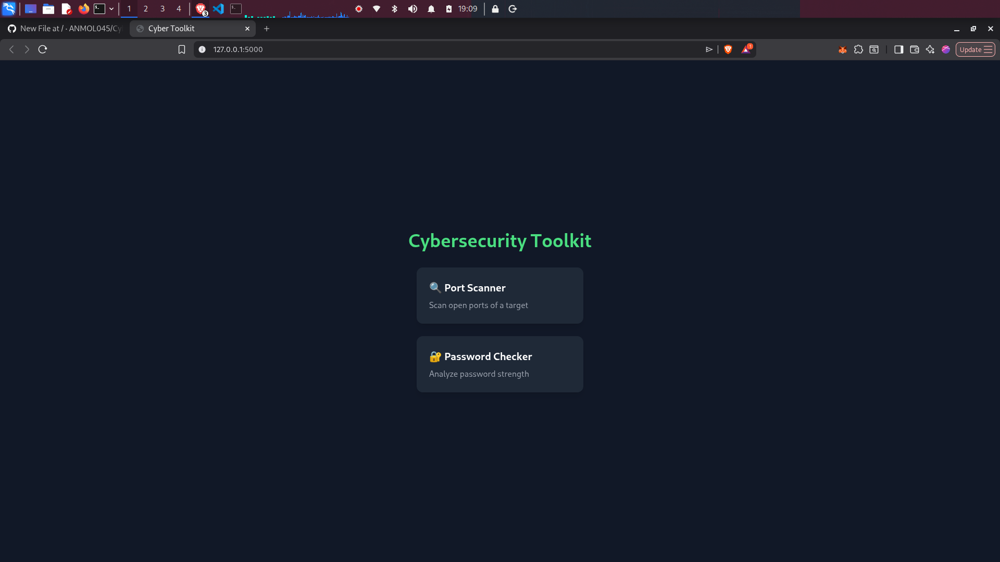
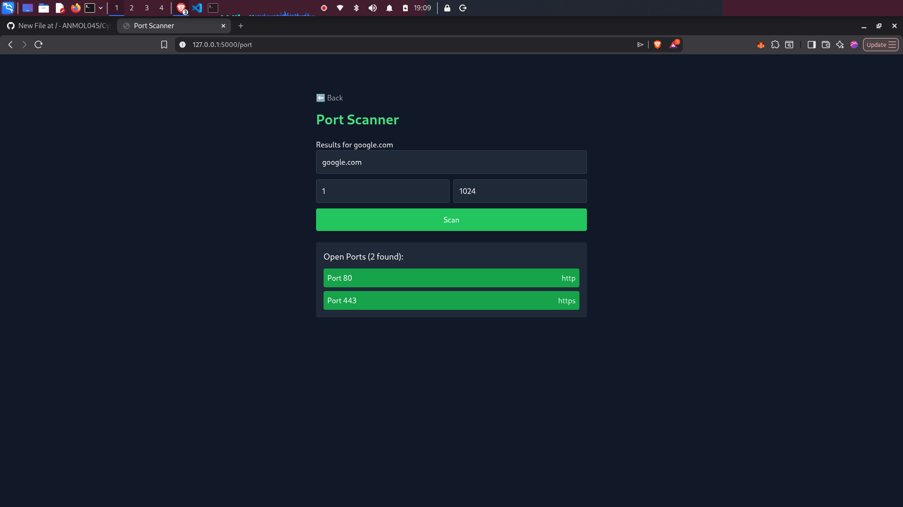
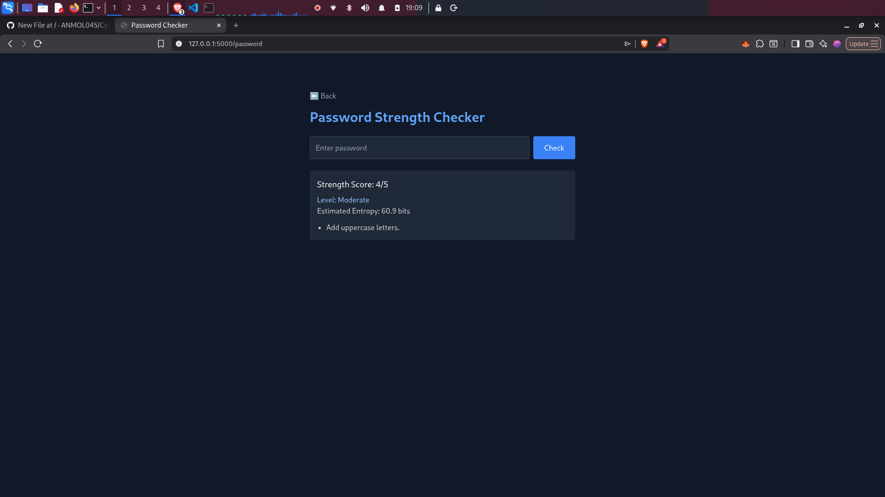

# 🔐 CyberSec Toolkit Web App

A modern web-based cybersecurity toolkit built using Flask and Tailwind CSS.
This project demonstrates practical security tools with an interactive UI.

---

## 🚀 Features

* 🔍 **Port Scanner**
  Scan open ports of a target system

* 🔐 **Password Strength Analyzer**
  Evaluate password security with scoring

* 🌐 **IP Information Lookup**
  Get location, ISP, and network details of an IP

---

## 🛠 Tech Stack

* Python (Flask)
* Tailwind CSS
* Socket Programming
* REST API (IP Lookup)

---

## 📸 Screenshots

### 🏠 Home Page



### 🔍 Port Scanner



### 🔐 Password Checker



---

## ⚙️ Installation & Setup

```bash
git clone https://github.com/ANMOL045/Cybersec-toolkit.git
cd Cybersec-toolkit

python3 -m venv .venv
source .venv/bin/activate

pip install flask requests
python app.py
```

---

## 🎯 Use Cases

* Cybersecurity beginners learning tools
* Network analysis practice
* Password security validation

---

## 📌 Future Improvements

* User authentication system
* Scan history dashboard
* Multithreaded scanning
* Deployment with database

---

## ⚠️ Disclaimer

This tool is intended for **educational purposes only**.
Do not use it on systems without permission.

---

## 👨‍💻 Author

**Anmol Nandurkar**
Aspiring Cybersecurity Engineer 🚀
